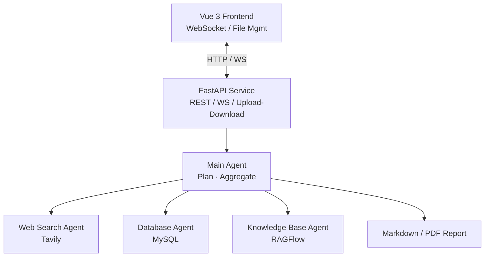

<div align="center">

# 🔍 DeepSearchResearcher

**A multi-agent deep-research assistant**

Ask one question — automatically search the web, query your database, retrieve from your knowledge base, and produce Markdown / PDF research reports.

[](https://www.python.org/)
[](https://fastapi.tiangolo.com/)
[](https://langchain-ai.github.io/langgraph/)
[](https://vuejs.org/)
[](https://opensource.org/licenses/MIT)

English · [简体中文](./README.md)

</div>

---

## ✨ Features

- 🤖 **Multi-agent collaboration** — A main agent decomposes the task and dispatches three specialized sub-agents (web search / database / knowledge base).
- 🌐 **Live progress feedback** — Tool calls, sub-agent calls and final results are pushed via WebSocket in real time.
- 📄 **Multi-format output** — Markdown reports are generated and can be converted to PDF in one step.
- 🔒 **Session isolation** — Per-coroutine `ContextVar` isolation, naturally safe under multi-user concurrency.
- 📎 **File uploads** — Drop in PDF / Word / Excel as research material; the agent reads them automatically.
- 🧩 **Easy to extend** — Add a sub-agent or tool by dropping a single file in the right folder.

---

## 🚀 Quick Start

### 1. Clone & install

```bash
git clone https://github.com/isJoker/DeepSearchResearcher.git
cd DeepSearchResearcher

# Backend (Python 3.13+ recommended in a venv)
pip install -r requirements.txt

# Frontend
cd ui && npm install && cd ..
```

### 2. Configure environment variables

Create a `.env` file in the project root:

```dotenv
# ===== LLM (OpenAI or any compatible endpoint) =====
OPENAI_API_KEY=sk-xxx
OPENAI_BASE_URL=https://api.openai.com/v1

# ===== Web search (Tavily) =====
TAVILY_API_KEY=tvly-xxx

# ===== MySQL =====
MYSQL_HOST=localhost
MYSQL_PORT=3306
MYSQL_USER=root
MYSQL_PASSWORD=your_password
MYSQL_DATABASE=your_database
# Optional
# MYSQL_CHARSET=utf8mb4
# MYSQL_COLLATION=utf8mb4_unicode_ci

# ===== RAGFlow knowledge base (optional) =====
RAGFLOW_API_KEY=ragflow-xxx
RAGFLOW_API_URL=http://your-ragflow-host
```

> 💡 The default model is `gpt-4o-mini`. Edit `agent/llm.py` to change it.

### 3. Run

```bash
# Terminal 1 — backend (from project root)
python -m api.server
# equivalent: cd api && python server.py

# Terminal 2 — frontend
cd ui && npm run dev
```

### 4. Open

| Service | URL |
| --- | --- |
| Frontend | http://localhost:5173 |
| Backend API | http://localhost:8000 |
| API Docs | http://localhost:8000/docs |

---

## 🏗 Architecture



**Flow:** user query → create session dir → bind `ContextVar` → main agent streams → sub-agents dispatched → tools executed → results aggregated → document generated → WebSocket pushes → context released.

---

## 🧠 Core Modules

### Main Agent (`agent/main_agent.py`)

Built with the `deepagents.create_deep_agent` factory:

```python
main_agent = create_deep_agent(
    model=model,
    system_prompt=main_agent_config['system_prompt'],
    tools=[generate_markdown, convert_md_to_pdf, read_file_content],
    checkpointer=InMemorySaver(),
    subagents=[
        database_query_agent,
        network_search_agent,
        knowledge_base_agent,
    ],
)
```

### Sub-Agents (`agent/sub_agent/`)

| Sub-agent | Purpose | Core tools |
| --- | --- | --- |
| `network_search_agent` | Public web retrieval | Tavily Search API |
| `database_query_agent` | Internal MySQL queries | `list_sql_tables` / `get_table_data` / `execute_sql_query` |
| `knowledge_base_agent` | RAGFlow knowledge base Q&A | `get_assistant_list` / `create_ask_delete` |

### Tools (`tools/`)

| File | Responsibility |
| --- | --- |
| `tavily_tool.py` | Web search (general / news / finance topics) |
| `db_tool.py` | List tables, preview rows, run custom SQL |
| `ragflow_tools.py` | RAGFlow assistants, ask, session mgmt |
| `markdown_tools.py` / `pdf_tools.py` | Markdown & PDF generation |
| `upload_file_read_tool.py` | Read uploaded PDF / Word / Excel / Text |

### WebSocket Message Protocol

| Event | Description | Payload |
| --- | --- | --- |
| `session_dir` | Session directory created | `{ path: "/output/session_xxx" }` |
| `tool_start` | Tool invocation started | `{ tool_name, args }` |
| `assistant_call` | Sub-agent invocation | `{ assistant_name, args }` |
| `task_result` | Final result | `{ result }` |
| `error` | Error | `{ message }` |

### Session Isolation

```python
# api/context.py
_session_dir_ctx: ContextVar[Optional[str]] = ContextVar("session_dir")
_thread_id_ctx:  ContextVar[Optional[str]] = ContextVar("thread_id")
```

Every async task has its own `ContextVar` view; tools and the monitor read from it, so concurrent users never see each other's data.

---

## 📂 Project Structure

```
DeepSearchResearcher/
├── agent/                 # Agent layer
│   ├── main_agent.py     # Main agent orchestration
│   ├── llm.py            # LLM initialization
│   ├── load_prompts.py   # YAML prompt loader
│   └── sub_agent/        # Three sub-agents
├── api/                   # API layer
│   ├── server.py         # FastAPI entry (REST + WebSocket)
│   ├── monitor.py        # Singleton monitor / pusher
│   ├── context.py        # ContextVar session isolation
│   └── logger.py
├── tools/                 # Tool collection
├── prompt/prompts.yaml    # Centralized prompts
├── utils/                 # Shared utilities
├── ui/                    # Vue 3 + Vite frontend
├── output/                # Generated reports (per-session)
├── updated/               # Uploaded files (per-session)
├── sql/                   # Sample data
└── requirements.txt
```

---

## 🛠 Tech Stack

**Backend** Python 3.13 · LangChain · LangGraph · deepagents · FastAPI · Uvicorn · MySQL Connector · Tavily · RAGFlow SDK
**Frontend** Vue 3 · TypeScript · Vite · Axios · Marked
**LLM** Any OpenAI-compatible endpoint (default `gpt-4o-mini`)

---

## 💡 Use Cases

- Industry / competitor research auto-drafting
- Hybrid analysis combining internal data with public information
- Knowledge base Q&A and summarization
- Multi-source "deep research" report writing

---

## 🤝 Contributing

Issues and PRs are welcome. To add a new sub-agent or tool, copy any existing one under `agent/sub_agent/` or `tools/` as a template.

## 📄 License

[MIT](./LICENSE)
