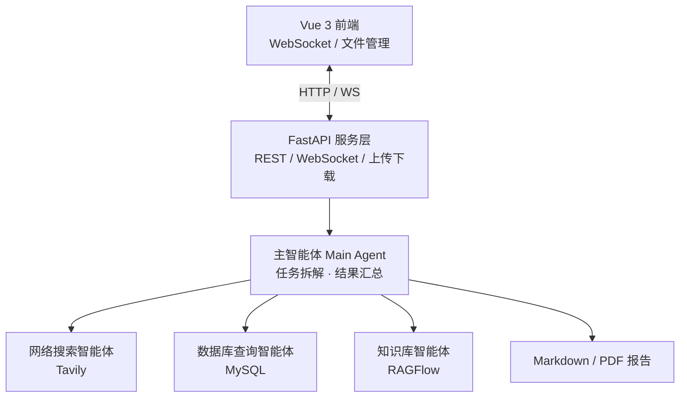

<div align="center">

# 🔍 DeepSearchResearcher

**基于多智能体协作的深度研究助手**

一句话提问，自动联网搜索 + 数据库查询 + 知识库检索 + 生成 Markdown / PDF 研究报告。

[](https://www.python.org/)
[](https://fastapi.tiangolo.com/)
[](https://langchain-ai.github.io/langgraph/)
[](https://vuejs.org/)
[](https://opensource.org/licenses/MIT)

[English](./README.en.md) · 简体中文


</div>

---

## ✨ 特性一览

- 🤖 **多智能体协作** — 主智能体自动拆解任务，调度网络搜索 / 数据库 / 知识库三个专业子智能体
- 🌐 **实时进度反馈** — WebSocket 全程推送工具调用、子智能体调用、最终结果
- 📄 **多格式产出** — 自动生成 Markdown 报告并一键转换为 PDF
- 🔒 **会话级隔离** — 基于 `ContextVar` 实现协程级隔离，天然支持多用户并发
- 📎 **支持文件上传** — 上传 PDF / Word / Excel 作为研究材料，Agent 自动读取分析
- 🧩 **易扩展** — 新增子智能体或工具只需在对应目录加一个文件

---

## 🚀 快速开始

### 1. 克隆并安装依赖

```bash
git clone https://github.com/isJoker/DeepSearchResearcher.git
cd DeepSearchResearcher

# 后端依赖（建议使用 Python 3.13+ 虚拟环境）
pip install -r requirements.txt

# 前端依赖
cd ui && npm install && cd ..
```

### 2. 配置环境变量

在项目根目录创建 `.env` 文件：

```dotenv
# ===== LLM（OpenAI 或兼容接口）=====
OPENAI_API_KEY=sk-xxx
OPENAI_BASE_URL=https://api.openai.com/v1

# ===== 网络搜索（Tavily）=====
TAVILY_API_KEY=tvly-xxx

# ===== MySQL 数据库 =====
MYSQL_HOST=localhost
MYSQL_PORT=3306
MYSQL_USER=root
MYSQL_PASSWORD=your_password
MYSQL_DATABASE=your_database
# 可选
# MYSQL_CHARSET=utf8mb4
# MYSQL_COLLATION=utf8mb4_unicode_ci

# ===== RAGFlow 知识库（可选）=====
RAGFLOW_API_KEY=ragflow-xxx
RAGFLOW_API_URL=http://your-ragflow-host
```

> 💡 默认使用模型 `gpt-4o-mini`，如需更换可修改 `agent/llm.py`。

### 3. 启动服务

```bash
# 终端 1：启动后端（项目根目录下）
python -m api.server
# 等价：cd api && python server.py

# 终端 2：启动前端
cd ui && npm run dev
```

### 4. 访问

| 服务 | 地址 |
| --- | --- |
| 前端界面 | http://localhost:5173 |
| 后端 API | http://localhost:8000 |
| API 文档 | http://localhost:8000/docs |

---

## 🏗 系统架构



**调用流程：** 用户提问 → 创建会话目录 → 绑定 `ContextVar` → 主智能体流式执行 → 子智能体并行调度 → 工具调用 → 结果汇总 → 生成文档 → WebSocket 推送 → 释放上下文。

---

## 🧠 核心模块

### 主智能体（agent/main_agent.py）

通过 `deepagents.create_deep_agent` 工厂方法构建，挂载工具与子智能体：

```python
main_agent = create_deep_agent(
    model=model,
    system_prompt=main_agent_config['system_prompt'],
    tools=[generate_markdown, convert_md_to_pdf, read_file_content],
    checkpointer=InMemorySaver(),
    subagents=[
        database_query_agent,
        network_search_agent,
        knowledge_base_agent,
    ],
)
```

### 子智能体（agent/sub_agent/）

| 子智能体 | 功能 | 核心工具 |
| --- | --- | --- |
| `network_search_agent` | 互联网公开信息检索 | Tavily Search API |
| `database_query_agent` | 企业内部 MySQL 查询 | `list_sql_tables` / `get_table_data` / `execute_sql_query` |
| `knowledge_base_agent` | RAGFlow 知识库问答 | `get_assistant_list` / `create_ask_delete` |

### 工具（tools/）

| 文件 | 职责 |
| --- | --- |
| `tavily_tool.py` | 网络搜索（支持 general / news / finance 主题） |
| `db_tool.py` | MySQL 表列举、预览、自定义 SQL 执行 |
| `ragflow_tools.py` | RAGFlow 助手列表、提问、会话管理 |
| `markdown_tools.py` / `pdf_tools.py` | 生成 Markdown 与 PDF |
| `upload_file_read_tool.py` | 读取上传的 PDF / Word / Excel / Text |

### WebSocket 消息协议

| 事件 | 说明 | 数据 |
| --- | --- | --- |
| `session_dir` | 会话目录已创建 | `{ path: "/output/session_xxx" }` |
| `tool_start` | 工具调用开始 | `{ tool_name, args }` |
| `assistant_call` | 子智能体调用 | `{ assistant_name, args }` |
| `task_result` | 任务最终结果 | `{ result }` |
| `error` | 异常 | `{ message }` |

### 会话隔离原理

```python
# api/context.py
_session_dir_ctx: ContextVar[Optional[str]] = ContextVar("session_dir")
_thread_id_ctx:  ContextVar[Optional[str]] = ContextVar("thread_id")
```

每个异步任务拥有独立 `ContextVar` 视图，工具调用、监控推送都从中读取，天然避免多用户并发串数据。

---

## 📂 目录结构

```
DeepSearchResearcher/
├── agent/                 # 智能体层
│   ├── main_agent.py     # 主智能体编排
│   ├── llm.py            # LLM 初始化
│   ├── load_prompts.py   # YAML 提示词加载
│   └── sub_agent/        # 三个子智能体
├── api/                   # API 服务层
│   ├── server.py         # FastAPI 入口（REST + WebSocket）
│   ├── monitor.py        # 单例式监控/推送
│   ├── context.py        # ContextVar 会话隔离
│   └── logger.py
├── tools/                 # 工具集
├── prompt/prompts.yaml    # 集中式提示词配置
├── utils/                 # 通用工具函数
├── ui/                    # Vue 3 + Vite 前端
├── output/                # 报告输出（按 session 隔离）
├── updated/               # 上传文件（按 session 隔离）
├── sql/                   # 示例数据
└── requirements.txt
```

---

## 🛠 技术栈

**后端**　Python 3.13 · LangChain · LangGraph · deepagents · FastAPI · Uvicorn · MySQL Connector · Tavily · RAGFlow SDK
**前端**　Vue 3 · TypeScript · Vite · Axios · Marked
**LLM**　 任意 OpenAI 兼容接口（默认 `gpt-4o-mini`）

---

## 💡 应用场景

- 行业 / 竞品研究报告自动撰写
- 企业内部数据 + 外部信息的混合分析
- 知识库问答与摘要生成
- 多源信息整合的「深度研究」类任务

---

## 🤝 贡献

欢迎 Issue 和 PR！如果你想新增子智能体或工具，参考 `agent/sub_agent/` 下任一现有 agent 即可快速复制扩展。

## 📄 License

[MIT](./LICENSE)
